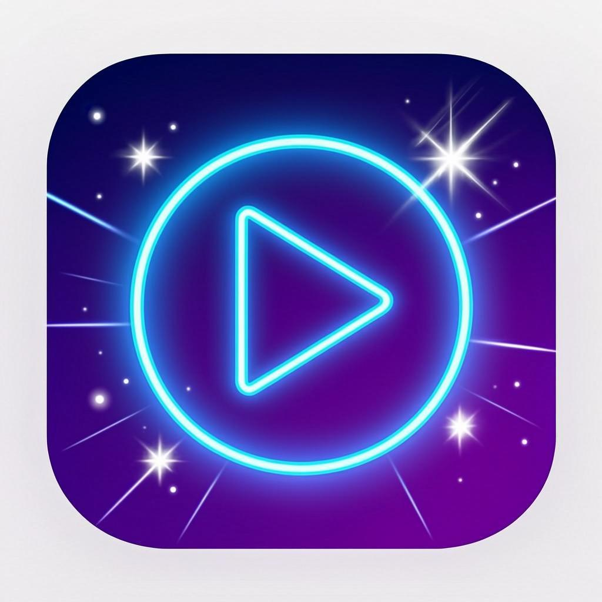

# 🎬 Magen Play 002

<div align="center">



**مشغل فيديو احترافي بستايل الأنمي مع محرر فيديو ومحول صوت**

[](https://developer.android.com)
[](https://kotlinlang.org)
[](https://developer.android.com/jetpack/compose)
[](LICENSE)

</div>

---

## 📖 نبذة عن المشروع

**Magen Play 002** هو تطبيق أندرويد متكامل يجمع بين ثلاث وظائف أساسية في تطبيق واحد بتصميم مستوحى من عالم الأنمي:

1. **مشغل فيديو احترافي** - يشبه MX Player مع دعم لجميع صيغ الفيديو
2. **محرر فيديو (قص وقطع)** - لقص وتقليم مقاطع الفيديو بسهولة
3. **محول فيديو إلى MP3** - لتحويل مقاطع الفيديو إلى ملفات صوتية بجودة عالية

## ✨ المميزات

### 🎥 مشغل الفيديو
- تشغيل جميع صيغ الفيديو (MP4, AVI, MKV, MOV, FLV, WMV, وغيرها)
- عرض قائمة بجميع ملفات الفيديو على الجهاز
- تحكم كامل في التشغيل (تشغيل، إيقاف، تقديم، ترجيع)
- عرض معلومات الفيديو (الدقة، الحجم، المدة)
- واجهة تحكم ذكية تختفي تلقائياً
- دعم التشغيل في الخلفية
- عرض صور مصغرة لكل فيديو

### ✂️ محرر الفيديو
- قص وتقليم مقاطع الفيديو بسهولة
- تحديد نقطة البداية والنهاية بدقة
- شريط زمني تفاعلي بتصميم الأنمي
- معاينة المقطع قبل القص
- حفظ المقطع المقطوع بجودة عالية بدون فقدان
- عرض المدة والأحجام بشكل واضح

### 🎵 محول الفيديو إلى MP3
- تحويل الفيديو إلى MP3 بجودة عالية
- دعم صيغ صوتية متعددة: MP3, AAC, WAV, FLAC, OGG, M4A
- خيارات جودة متعددة: 128k, 192k, 256k, 320k
- شريط تقدم متحرك أثناء التحويل
- حفظ تلقائي في مجلد الموسيقى

### 🎨 تصميم الأنمي
- واجهة مستخدم داكنة مستوحاة من الأنمي
- ألوان نيون متوهجة (أزرق، وردي، بنفسجي)
- تأثيرات حركية سلسة
- أيقونات وتصميم أنيق
- تبويبات ملونة لكل وظيفة

## 🔧 التقنيات المستخدمة

| التقنية | الاستخدام |
|---------|----------|
| **Kotlin** | لغة البرمجة الرئيسية |
| **Jetpack Compose** | بناء واجهة المستخدم |
| **Media3 / ExoPlayer** | تشغيل الفيديو |
| **FFmpeg** | معالجة الفيديو والتحويل |
| **Material Design 3** | التصميم والمكونات |
| **Coil** | تحميل الصور المصغرة |
| **Navigation Compose** | التنقل بين الشاشات |
| **DataStore** | حفظ الإعدادات |
| **Accompanist** | إدارة الصلاحيات |

## 📂 هيكل المشروع

```
MagenPlay002/
├── app/
│   ├── src/
│   │   ├── main/
│   │   │   ├── java/com/magenplay002/app/
│   │   │   │   ├── MagenPlayApp.kt          # فئة التطبيق
│   │   │   │   ├── MainActivity.kt          # النشاط الرئيسي
│   │   │   │   ├── ui/
│   │   │   │   │   ├── theme/
│   │   │   │   │   │   ├── Color.kt         # ألوان الأنمي
│   │   │   │   │   │   ├── Type.kt          # الخطوط
│   │   │   │   │   │   └── Theme.kt         # الثيم
│   │   │   │   │   ├── player/
│   │   │   │   │   │   └── VideoPlayerScreen.kt  # شاشة المشغل
│   │   │   │   │   ├── editor/
│   │   │   │   │   │   └── VideoEditorScreen.kt  # شاشة المحرر
│   │   │   │   │   └── converter/
│   │   │   │   │       └── VideoConverterScreen.kt # شاشة المحول
│   │   │   │   ├── viewmodel/
│   │   │   │   │   └── VideoListViewModel.kt # نموذج العرض
│   │   │   │   └── util/
│   │   │   │       ├── FileUtils.kt          # أدوات الملفات
│   │   │   │       └── FFmpegUtils.kt        # أدوات FFmpeg
│   │   │   ├── res/
│   │   │   │   ├── mipmap-*/                 # الأيقونات
│   │   │   │   ├── values/
│   │   │   │   │   ├── strings.xml           # النصوص
│   │   │   │   │   ├── colors.xml            # الألوان
│   │   │   │   │   └── themes.xml            # الثيمات
│   │   │   │   └── drawable/                 # الرسوميات
│   │   │   └── AndroidManifest.xml           # ملف البيان
│   │   └── ...
│   └── build.gradle.kts                      # إعدادات البناء
├── build.gradle.kts                          # إعدادات المشروع
├── settings.gradle.kts                       # إعدادات Gradle
├── gradle.properties                         # خصائص Gradle
├── gradle/wrapper/                           # Gradle Wrapper
└── README.md                                 # هذا الملف
```

## 🏗️ المشاريع المفتوحة المصدر المستخدمة

هذا المشروع مبني على أساس مشاريع مفتوحة المصدر ممتازة:

### 1. Next Player (مشغل الفيديو)
- **المستودع**: [anilbeesetti/nextplayer](https://github.com/anilbeesetti/nextplayer)
- **الوظيفة**: مشغل فيديو أندرويد مكتوب بـ Kotlin و Jetpack Compose
- **التقنيات**: Media3/ExoPlayer, Jetpack Compose, Material Design 3
- **الاستخدام في المشروع**: واجهة مشغل الفيديو وتشغيل جميع صيغ الفيديو

### 2. SimpleVideoEditor (محرر الفيديو)
- **المستودع**: [fahimfarhan/SimpleVideoEditor](https://github.com/fahimfarhan/SimpleVideoEditor)
- **الوظيفة**: محرر فيديو بسيط يستخدم Mp4Composer للقص والتقطيع
- **التقنيات**: Mp4Composer, MediaCodec API
- **الاستخدام في المشروع**: واجهة قص الفيديو واختيار النطاق الزمني

### 3. Video To Audio Converter (محول الفيديو لصوت)
- **المستودع**: [stsaikat/videotoaudioconverter](https://github.com/stsaikat/videotoaudioconverter)
- **الوظيفة**: محول فيديو إلى صوت بدعم عدة صيغ
- **التقنيات**: FFmpeg, MediaExtractor
- **الاستخدام في المشروع**: واجهة تحويل الفيديو إلى MP3 والصيغ الصوتية الأخرى

## 🚀 كيفية البناء

### المتطلبات
- Android Studio Hedgehog أو أحدث
- JDK 17
- Android SDK 34
- Gradle 8.5

### خطوات البناء

1. **استنساخ المشروع**:
```bash
git clone https://github.com/yourusername/MagenPlay002.git
cd MagenPlay002
```

2. **فتح المشروع في Android Studio**:
- افتح Android Studio
- اختر "Open an Existing Project"
- اختر مجلد MagenPlay002

3. **بناء المشروع**:
```bash
./gradlew assembleDebug
```

4. **بناء نسخة الإصدار**:
```bash
./gradlew assembleRelease
```

5. **تثبيت على الجهاز**:
```bash
./gradlew installDebug
```

## 📱 كيفية الاستخدام

### مشغل الفيديو (الشاشة الافتراضية)
1. افتح التطبيق - ستظهر قائمة بجميع ملفات الفيديو على جهازك
2. اضغط على أي فيديو لتشغيله
3. استخدم أزرار التحكم للتشغيل والإيقاف والتقديم

### محرر الفيديو
1. انتقل إلى تبويب "Editor"
2. اضغط على "Select Video" لاختيار فيديو
3. حدد نقطة البداية والنهاية باستخدام أشرطة التمرير
4. اضغط على "Trim Video" لقص المقطع
5. سيتم حفظ المقطع في مجلد Movies/MagenPlay

### محول الفيديو إلى MP3
1. انتقل إلى تبويب "MP3 Converter"
2. اضغط على "Select Video File" لاختيار فيديو
3. اختر صيغة الصوت المطلوبة (MP3, AAC, WAV, إلخ)
4. اختر جودة الصوت (128k - 320k)
5. اضغط على "Convert" للتحويل
6. سيتم حفظ الملف في مجلد Music/MagenPlay

## 📋 الصلاحيات المطلوبة

| الصلاحية | السبب |
|---------|-------|
| `READ_MEDIA_VIDEO` | قراءة ملفات الفيديو (Android 13+) |
| `READ_MEDIA_AUDIO` | قراءة ملفات الصوت (Android 13+) |
| `READ_EXTERNAL_STORAGE` | قراءة التخزين (Android 12 وأقل) |
| `WRITE_EXTERNAL_STORAGE` | حفظ الملفات المقطوعة والمحولة |
| `INTERNET` | للتحديثات والمعلومات |
| `WAKE_LOCK` | منع إيقاف التشغيل في الخلفية |
| `FOREGROUND_SERVICE` | خدمة التشغيل في الخلفية |
| `POST_NOTIFICATIONS` | إشعارات التحويل (Android 13+) |

## 🎨 لوحة الألوان

| اللون | الكود | الاستخدام |
|-------|-------|----------|
| 🔵 Anime Blue | `#00D4FF` | العنصر الأساسي / مشغل الفيديو |
| 🩷 Anime Pink | `#FF2D78` | المحرر |
| 🟣 Anime Purple | `#9D4EDD` | المحول |
| 🟠 Anime Orange | `#FF6B35` | التنبيهات |
| ⬛ Dark BG | `#0A0E1A` | الخلفية |
| 🟫 Dark Card | `#1C2237` | البطاقات |

## 🤝 المساهمة

المساهمات مرحب بها! اتبع الخطوات التالية:

1. قم بعمل Fork للمشروع
2. أنشئ فرع جديد (`git checkout -b feature/amazing-feature`)
3. قم بالتغييرات والالتزام (`git commit -m 'Add amazing feature'`)
4. ادفع إلى الفرع (`git push origin feature/amazing-feature`)
5. افتح طلب سحب (Pull Request)

## 📄 الرخصة

هذا المشروع مرخص تحت رخصة MIT - راجع ملف [LICENSE](LICENSE) للتفاصيل.

## 🙏 شكر وتقدير

- [Next Player](https://github.com/anilbeesetti/nextplayer) - مشغل الفيديو المفتوح المصدر
- [SimpleVideoEditor](https://github.com/fahimfarhan/SimpleVideoEditor) - محرر الفيديو البسيط
- [Video To Audio Converter](https://github.com/stsaikat/videotoaudioconverter) - محول الفيديو للصوت
- [ExoPlayer/Media3](https://github.com/androidx/media) - مكتبة تشغيل الوسائط من Google
- [FFmpeg](https://ffmpeg.org/) - أداة معالجة الوسائط المتعددة
- [FFmpeg Kit](https://github.com/arthenica/ffmpeg-kit) - FFmpeg للأندرويد

---

<div align="center">
صُنع بـ 💙 بواسطة Magen Play Team
</div>
